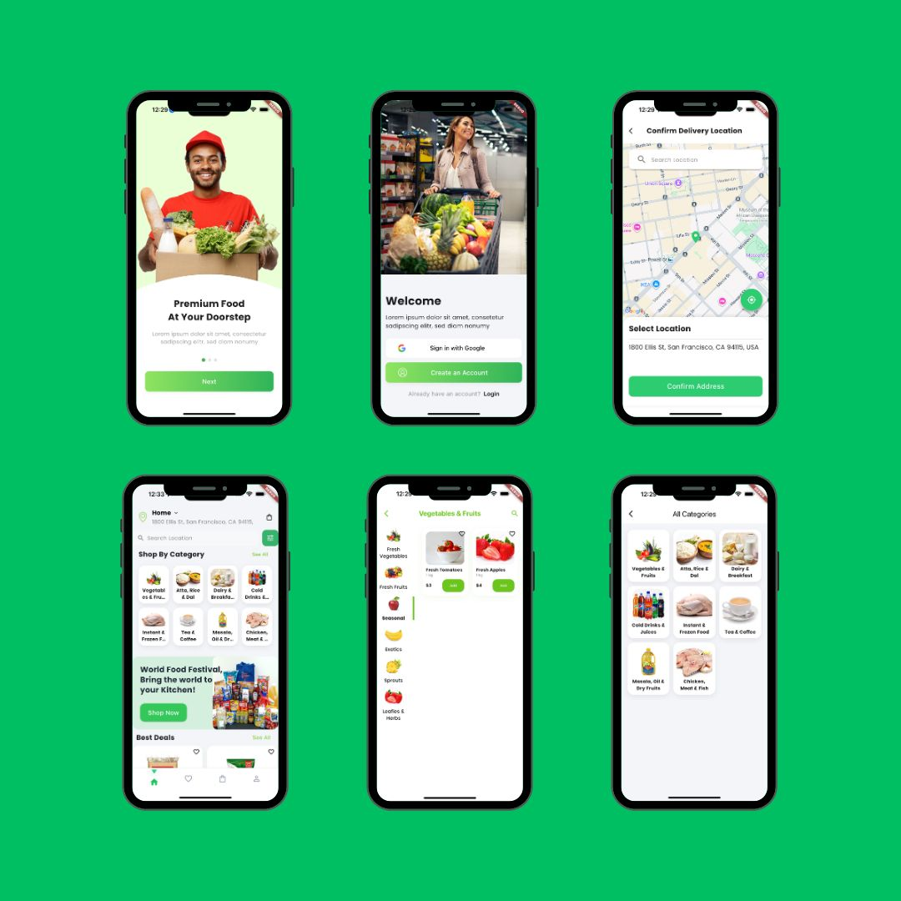

# Progros - Flutter Shopping App

A modern, responsive Flutter shopping app featuring:

- Checkout with basket, discounts, and totals
- Location selection with map and reverse geocoding
- Recommended products with sticky scroll and animations
- Cached images with shimmer loaders
- Custom navigation and spacing extensions

## Screenshots

Below is a preview from the app:

## Key Features

- Responsive, modular UI using ScreenUtil
- Basket management with stepper, removal, and Dismissible
- Recommended products with persistent scroll controller
- Checkout summary: item total, discount, delivery, grand total
- Address from LocationCubit and SharedPreferences
- CachedNetworkImage + shimmer placeholders

## Getting Started

1. Ensure Flutter is installed
2. Create a `.env` file at the project root:
   
   GOOGLE_API_KEY=YOUR_GOOGLE_API_KEY
   
3. Run the app:
   
   flutter pub get
   flutter run

## Project Structure

- `lib/` main app code
- `assets/` fonts, images, and screenshot(s)
- Platform code for iOS, Android, web, macOS, linux, windows

## License

This project is for demonstration purposes.
